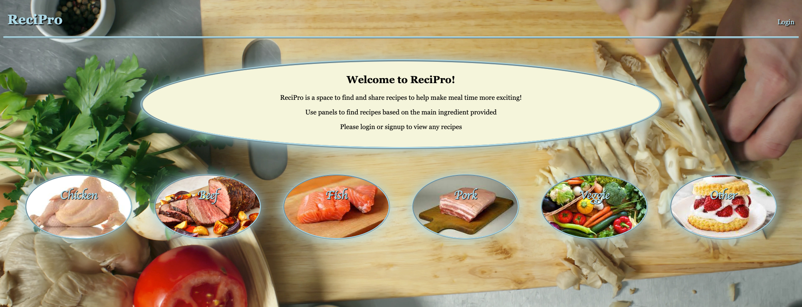

# ReciPro-sitory



## Table of Contents
- [Installation](#installation)
- [Usage](#usage)
- [Contributors](#contributors)

## About the Project

ReciPro is an easy to use site for users to find, create, and share recipes with other users! Users must signup and then login before being able to create a recipe. When creating recipes, the user is able to add what ingredients will be used for the dish, as well as a description of the recipe so others are able to recreate it!

### Built With
- Node.js
- Express.js
- Mysql2
- Nodemon
- Sequelize
- Handlebars
- Express Handlebars
- Dotenv
- Bcrypt
- CSS

## Installation

* Install npm packages
```
npm install
```
* Run Mysql
```
mysql -u root -p
```
* Run the database
```
source db/schema.sql
```
- Make sure to change .env password!

## Usage

Link to live demo of ReciPro
- [https://drive.google.com/file/d/1oOoeZHzUQkrvznYKLYud_KdWOwS-lIY7/view?usp=sharing]

Link to deployed website on Heroku
- [https://recipro-app.herokuapp.com/]

Link to ReciPro respository
- [https://github.com/TR742/ReciPro-sitory]

## Contributors

- Lawson Vanderpool - [https://github.com/LawsonSV]
- Brant Martin - [https://github.com/BrantMartin]
- Phillip Mock - [https://github.com/phlipadelphia]
- Tyler Richard - [https://github.com/TR742]